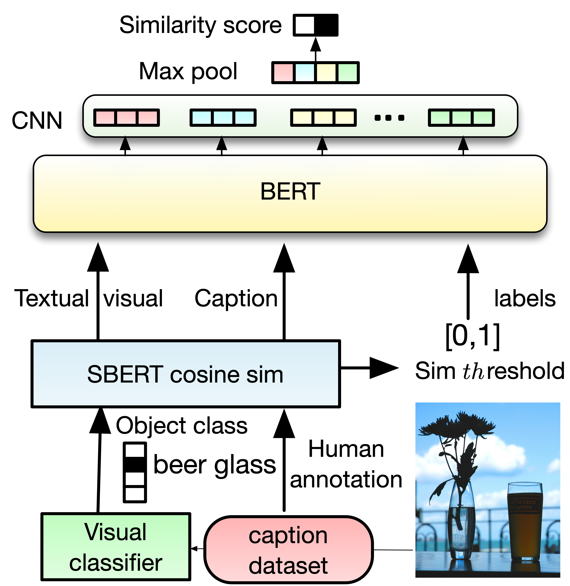
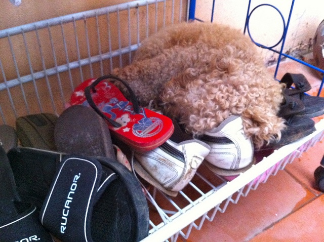
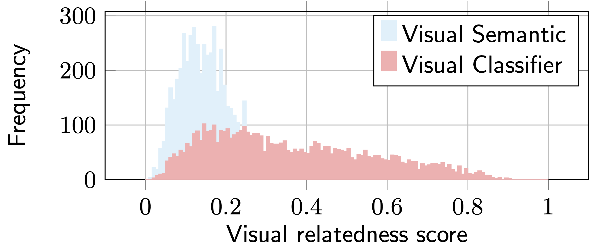

# Visual Semantic Relatedness Dataset for Image Captioning

<!--
  


Modern image captioning relies heavily on extracting knowledge, from images such as objects, to capture the concept of a static story in the image. 
In this paper, we propose a textual visual context dataset for image captioning, where the publicly available dataset COCO Captions 
[(Lin et al., 2014)](https://arxiv.org/pdf/1405.0312.pdf) has been extended with information about the scene (such as objects in the image). Since this information has textual form, it can be used to leverage any NLP task, such as text similarity or semantic relation methods, into captioning systems, either as an end-to-end training strategy or a post-processing based approach.
-->


Modern image captioning relies heavily on extracting knowledge, from images such as objects, to capture the concept of a static story in the image. 
In this paper, we propose a textual visual context dataset for image captioning, where the publicly available dataset COCO Captions [(Lin et al., 2014)](https://arxiv.org/pdf/1405.0312.pdf) has been extended with information  about the scene (such as objects in the image). Since this information has textual form, it can be used to leverage any NLP task, such as text similarity or semantic relation methods, into captioning systems, either as an end-to-end training strategy or a post-processing based approach.


This repository contains the  implementation of the paper  [Visual Semantic Relatedness Dataset for Image Captioning](https://arxiv.org/abs/2301.08784).

[](https://arxiv.org/abs/2301.08784)  [](https://ahmed.jp/project_page/Dataset_2022/index.html)
[](https://huggingface.co/datasets/AhmedSSabir/Textual-Image-Caption-Dataset)
[](https://ahmed.jp/project_page/Dataset_2022/poster_20.pdf)
[](https://ahmed.jp/project_page/Dataset_2022/spotlight_ppt_ID_20.pdf)
<!--[](https://youtu.be/-br99Q--bxM)-->


##  Contents
0. [Overview](#overview)
1. [Visual semantic with BERT ](#Visual-semantic-with-BERT-CNN)
2. [Dataset](#dataset)
3. [Visual semantic with pre-trained model](#Visual-semantic-with-pre-trained-model)
4. [Evaluation](#evaluation)
5. [Citation](#Citation)


## Overview
 

We enrich COCO-Captions with **Textual Visual Context** information. We use [ResNet152](https://www.cv-foundation.org/openaccess/content_cvpr_2016/papers/He_Deep_Residual_Learning_CVPR_2016_paper.pdf), [CLIP](https://github.com/openai/CLIP) and [Faster R-CNN](https://github.com/tensorflow/models/tree/master/research/object_detection) to extract
 object information for each COCO-caption image. We use three filter approaches to ensure the quality of the dataset   (1) Threshold: to filter out predictions where the object classifier  is not confident enough, and (2) semantic alignment with semantic similarity to remove duplicated objects. (3) semantic relatedness score as Soft-Label:  to guarantee the visual context and caption have strong relation, we use [Sentence RoBERTa-sts](https://www.sbert.net) to give a soft label via cosine similarity and then we use a **th**reshold to annotate the final label (if th ≥ 0.2, 0.3, 0.4 then [1,0]). Finally, to take advantage of the overlapping between the visual context and the caption, and to extract global information from each visual, we use BERT followed by a shallow CNN [(Kim, 2014)](https://arxiv.org/pdf/1408.5882.pdf) to estimate the visual relatedness score. 


## Quick Start 
For a quick start please have a look at this [project page](https://sabirdvd.github.io/project_page/Dataset_2022/index.html) 
and [Demo](https://github.com/ahmedssabir/Textual-Visual-Semantic-Dataset/blob/main/BERT_CNN_Visual_re_ranker_demo.ipynb)  

<!--
[](https://github.com/ahmedssabir/Textual-Visual-Semantic-Dataset/blob/main/BERT_CNN_Visual_re_ranker_demo.ipynb)
-->
## Dataset 

### Sample 
 
 VC1     | VC2   |  VC3   | human annoated caption     | 
| ------------- | ------------- |------------- | ------------- |
| cheeseburger  | plate       |  hotdog   |    a plate with a hamburger fries and tomatoes   |
| bakery  | dining table       |  website   |    a table having tea and a cake on it   |
| gown  | groom       |  apron   |    its time to cut the cake at this couples wedding   |


### Download 

0. [Dowload Raw data with ID and Visual context](https://www.dropbox.com/s/xuov24on8477zg8/All_Caption_ID.csv?dl=0) -> original dataset with related ID caption [train2014](https://cocodataset.org/#download)
1. [Downlod Data with cosine score](https://www.dropbox.com/s/55sit8ow9tems4u/visual_caption_cosine_score.zip?dl=0)-> soft cosine lable with **th** 0.2, 0.3, 0.4 and 0.5 and hard-label
2. [Dowload Overlaping visual with caption](https://www.dropbox.com/s/br8nhnlf4k2czo8/COCO_overlaping_dataset.txt?dl=0)-> Overlap visual context and the human annotated caption 
3. [Download Dataset (tsv file)](https://www.dropbox.com/s/dh38xibtjpohbeg/train_all.zip?dl=0) 0.0-> raw data with hard lable without cosine similairty and with **th**reshold  cosine sim degree of the relation beteween the visual and caption = 0.2, 0.3, 0.4
4. [Download Dataset GenderBias](https://www.dropbox.com/s/1wki0b0d21078mj/gender%20natural.zip?dl=0)-> man/woman replaced with person class label


## Visual semantic with BERT-CNN  
Fine-tune [BERT](https://github.com/google-research/bert) on the created  dataset. 

### Requirements
- Tensorflow 1.15.0
- Python 3.6

```
conda create -n BERT_visual python=3.6 anaconda
conda activate BERT_visual
pip install tensorflow==1.15.0
pip install --upgrade tensorflow_hub==0.7.0
``` 

Download BERT check point [uncased_L-12_H-768_A-12](https://tfhub.dev/google/bert_uncased_L-12_H-768_A-12/1)
```
wget https://storage.googleapis.com/bert_models/2018_10_18/uncased_L-12_H-768_A-12.zip
unzip uncased_L-12_H-768_A-12.zip
git clone https://github.com/gaphex/bert_experimental/
```
like this ```BERT-CNN/uncased_L-12_H-768_A-12 ``` and  ```BERT-CNN/bert_experimental ```

Download dataset

```
wget https://www.dropbox.com/s/dh38xibtjpohbeg/train_all.zip
unzip train_all.zip
```

for Training 

```
parser.add_argument('--train',  default='train.tsv', help='beam serach', type=str,required=False)  
parser.add_argument('--num_bert_layer', default='12', help='truned layers', type=int,required=False)  
parser.add_argument('--batch_size', default='128', help='truned layers', type=int,required=False) 
parser.add_argument('--epochs', default='5', help='', type=int,required=False) 
parser.add_argument('--seq_len', default='64', help='', type=int,required=False) 
parser.add_argument('--CNN_kernel_size', default='3', help='', type=int,required=False) 
parser.add_argument('--CNN_filters', default='32', help='', type=int,required=False)
```

```
python BERT_CNN.py --train /train_0.4.tsv --epochs 5
```

for inference only, download pre-trained model 

```
wget https://www.dropbox.com/s/ip7p0wiwkwvph5k/0.4_bert-cnn.zip
unzip 0.4_bert-cnn.zip
``` 

```
python eval.py --testset test_demo.tsv --model 0.4_bert-cnn/frozen_graph.pb
```
### Example 

Re-rank the most related caption to the image using the visual context information.

  

 ```
 visual information, candidate caption (beam search)
 standard poodle shopping cart footwear, a close up of shoes and a dog in a basket, 0.99774158
 standard poodle shopping cart footwear, a brown teddy bear laying on top of a pair of shoes, 0.0621758029 
 ```
 
## Visual semantic with pre-trained model  


<!--
 
-->

 


Although this approach is proposed to take the advantage of the dataset (_e.g._ visual semantic model), we also investigate the use of out-of-the-box tools to estimate the relatedness score between the short text (_i.e._ caption)  and its environmental visual context (we call it visual classifier). 

For this we follow similarity to probability based approach but 

we use only the cosine similarity from a pre-trained model and the top-3 averaged prob (confidence) from the object classifier as:

<!--
 
-->

$\text{P}(w \mid c)=\text{}sim(w,c)^{\text{P}(c)}$ 
where the main components of the visual semantics re-ranker:
<!--
1. Simialrity/relatedness between the caption and the object context  
-->
1. Simialrity/relatedness between the caption and the object context  $\text{}sim(w,c)$ 

<!--
2.   is the classifier confidnent 
-->

2. $\text{P}(c)$  is the classifier object confident in the image $\text{P}(w \mid \text{object})$ 


with Pre-trained [SBERT](https://www.sbert.net)

```
 python model.py --vis visual-context_label.txt --vis_prob visual-context_prob.txt --c caption.txt
```
Please refer to this [repository](https://github.com/ahmedssabir/Belief-Revision-Score) for more information about pre-trained visual re-ranker [probability from similarity](https://cdn.aaai.org/Symposia/Spring/2003/SS-03-05/SS03-05-005.pdf)

## Evaluation

[Download pycocoevalcap](https://github.com/salaniz/pycocoevalcap)

```
pip install pycocoevalcap
``` 

Then run
```
python Evaluation/coco_eval.py --f Result_tune_BERT_0.4.json
```
For more evaluation ([Lexical and Semantic Diversity](https://github.com/ahmedssabir/Belief-Revision-Score/tree/main/SBERT-caption-eval)) 
<!--
## Synthetic + Real caption dataset 

For future work, we plan to extract the visual context from the caption (without using a visual classifier) and estimate the visual relatedness score by
employing unsupervised learning (i.e. contrastive learning). (work in progress)

Feel free to download the training data 

 
 1. [Download CC](https://www.dropbox.com/s/pc1uv2rf6nqdp57/CC_caption_40.txt.zip) -> Caption dataset from [Conceptual Captions](https://github.com/google-research-datasets/conceptual-captions) (CC) 2M (2255927 captions)
 2. [Download CC+wiki](https://www.dropbox.com/s/xuov24on8477zg8/All_Caption_ID.csv?dl=0) -> CC+1M-wiki 3M (3255928) 
 3. [Download CC+wiki+COCO](https://www.dropbox.com/s/k7oqwr9a1a0h8x1/CC_caption_40%2Bwiki%2BCOCO.txt.zip) -> CC+wiki+COCO-Caption 3.5M (366984)
 4. [Download COCO-caption+wiki](https://www.dropbox.com/s/wc4k677wp24kzhh/COCO%2Bwiki.txt.zip) -> COCO-caption +wiki 1.4M (1413915)
 5. [Download COCO-caption+wiki+CC+8Mwiki](https://www.dropbox.com/s/xhfx32sjy2z5bpa/11M_wiki_7M%2BCC%2BCOCO.txt.zip) -> COCO-caption+wiki+CC+8Mwiki 11M (11541667) 

-->


## Citation

The details of this repo are described in the following paper. If you find this repo useful, please kindly cite it:

```bibtex
@article{sabir2023visual,
  title={Visual Semantic Relatedness Dataset for Image Captioning},
  author={Sabir, Ahmed and Moreno-Noguer, Francesc and Padr{\'o}, Llu{\'\i}s},
  journal={arXiv preprint arXiv:2301.08784},
  year={2023}
}
```

